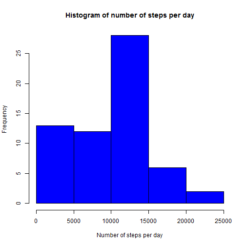
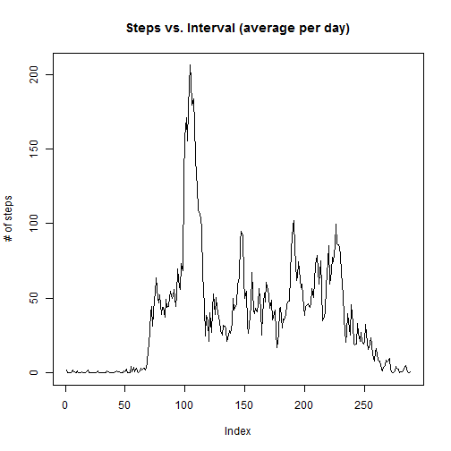
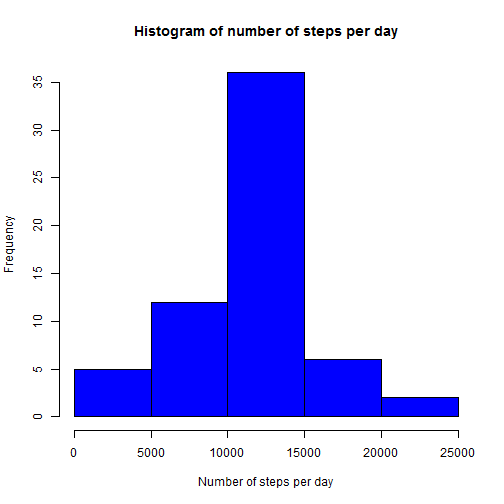
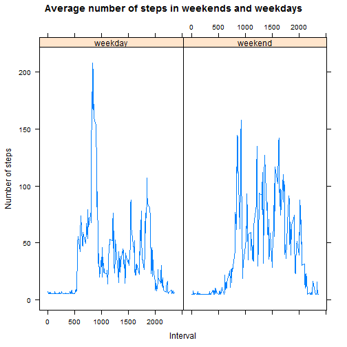

# Reproducible Research: Peer Assessment 1

## Loading and preprocessing the data

```r
activity=read.csv("activity.csv")
```

## What is mean total number of steps taken per day?
Total number of steps taken per day

```r
steps_per_day=tapply(activity$steps,activity$date,sum,na.rm=TRUE)
```
Histogram of the total number of steps taken each day

```r
hist(steps_per_day, breaks = 6, main = "Histogram of number of steps per day", 
xlab = "Number of steps per day", ylab = "Frequency", col = "blue")
```

 

Mean of the total number of steps taken per day

```r
mean_steps_per_day=mean(steps_per_day)
mean_steps_per_day
```

```
## [1] 9354.23
```

Median of the total number of steps taken per day

```r
median_steps_per_day=median(steps_per_day)
median_steps_per_day
```

```
## [1] 10395
```

## What is the average daily activity pattern?
Time series plot of the 5-minute interval (x-axis) and the average number of steps taken, averaged across all days (y-axis)

```r
steps_mean_per_interval <- tapply(activity$steps, activity$interval, mean, na.rm = T)
plot(steps_mean_per_interval, type = "l", main = ("Steps vs. Interval (average per day)"),
ylab = "# of steps")
```

 

5-minute interval, which on average across all the days in the dataset, contains the maximum number of steps

```r
names(which.max(steps_mean_per_interval))
```

```
## [1] "835"
```

##Imputing missing values
Missing values in the dataset

```r
no_NA=sum(is.na(activity$steps))
no_NA
```

```
## [1] 2304
```
Creation of new dataset with filled missing values 
- I will fill the NA with # mean steps in interval

```r
activity1=activity
x=mean(activity$steps, na.rm = T)
activity1[is.na(activity1)] <- x
```

Histogram of the total number of steps taken each day

```r
steps_per_day1=tapply(activity1$steps,activity1$date,sum)
hist(steps_per_day1, breaks = 6, main = "Histogram of number of steps per day",
xlab = "Number of steps per day", ylab = "Frequency", col = "blue")
```

 

Mean of the total number of steps taken per day

```r
mean_steps_per_day1=mean(steps_per_day1)
mean_steps_per_day1
```

```
## [1] 10766.19
```
Median of the total number of steps taken per day

```r
median_steps_per_day1=median(steps_per_day1)
median_steps_per_day1
```

```
## [1] 10766.19
```
Difference in means

```r
mean_steps_per_day-mean_steps_per_day1
```

```
## [1] -1411.959
```

Difference in medians

```r
median_steps_per_day-median_steps_per_day1
```

```
## [1] -371.1887
```

## Differences in activity patterns between weekdays and weekends

New factor variable in the dataset with two levels – “weekday” and “weekend” indicating whether a given date is a weekday or weekend day


```r
library("chron")
for (i in 1:nrow(activity1)) {
  if(!(is.weekend(as.Date(activity1$date[i])))){
    activity1$DayType[i]="weekday"
  }else{
    activity1$DayType[i]="weekend"
  }
}
activity1$DayType=as.factor(activity1$DayType)
```

Panel plot which contains a time series plot of the 5-minute interval (x-axis) and the average number of steps taken, averaged across all weekday days or weekend days (y-axis)


```r
library(lattice)
activity2=aggregate(steps~interval+DayType,data=activity1,mean)
xyplot(steps~interval|DayType,activity2,type="l",layout=c(2,1),
main="Average number of steps in weekends and weekdays",xlab="Interval",
ylab="Number of steps")
```

 

